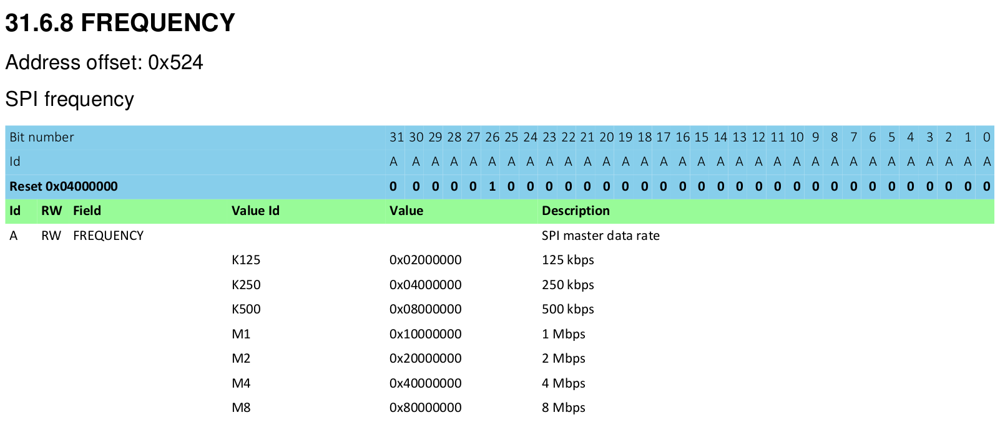

# Arbitrary Memory

On a microcontroller, when you write some data to a certain address, like `0x2000_0000`, or even `0x0000_0000`, you're really writing to that address. There isn't anything like an MMU which is abstracting one chunk of memory to some other virtual address.

Because 32 bit microcontrollers have this real and linear memory space, from `0x0000_0000`, and `0xFFFF_FFFF`, and they only generally use a few hundred kilobytes of it for actual memory, there is lots of room left over. Instead of ignoring that space, Microcontroller designers instead put the interface for parts of the hardware, like peripherals, in certain memory locations. This ends up looking something like this:

* Hardware developers decided to repurpose that space
* So this ends up looking like this:

> TODO: cite the nrf52 datasheet for this image

* Memory here, flash over here, serial port over there
* To configure something? Write to arbitrary memory locations!
* To use something? Write to arbitrary memory locations!

So for example, if you want to send 32 bits of data over a serial port, you write to the address of the serial port output buffer, and the Serial Port Peripheral takes over and sends out the data for you automatically. If you want to turn an LED on? You write one bit in a special memory address, and the LED turns on.

Configuration of these peripherals works the same. Instead of calling a function to configure some peripheral, they just have a chunk of memory which serves as the hardware API. Write `0x8000_0000` to this address, and the serial port will send data at 1 Megabit per second. Write `0x0800_0000` to this address, and the serial port will send data at 512 Kilobits per second. Write `0x0000_0000` to another address, and the serial port gets disabled. You get the idea. These configuration registers look a little bit like this:

* Important part: Values, at location
* Same for Assembly, C, or Rust

This interface is how you interact with the hardware, no matter what language you are talking about. Assembly, C, and also Rust.